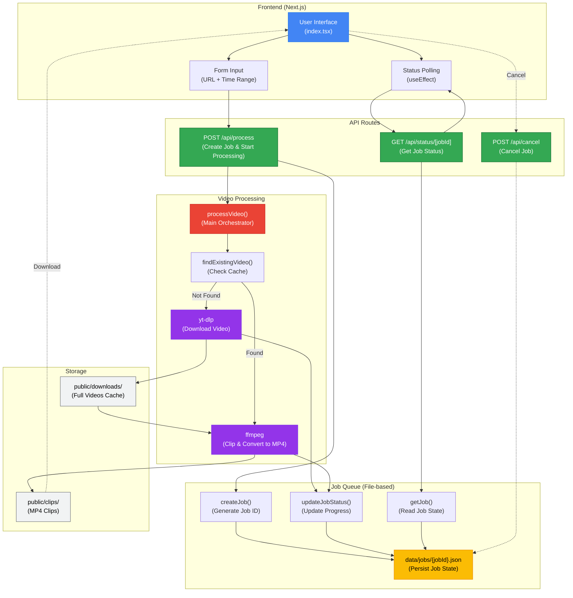

# YouTube Clipper

A high-performance web application for downloading and clipping YouTube videos with precision. Built with Next.js, featuring intelligent file caching and high-quality MP4 output.

## 🏗️ Architecture Diagram



### Architecture Flow

1. **User Submission** → User enters YouTube URL and time range in the form
2. **Job Creation** → API creates a job with unique ID and persists to `data/jobs/{jobId}.json`
3. **Async Processing** → Video processing starts in background (non-blocking)
4. **Cache Check** → System checks `public/downloads/` for existing video
5. **Download** → If not cached, yt-dlp downloads video in native format
6. **Clip & Convert** → ffmpeg clips the video and outputs high-quality MP4 to `public/clips/`
7. **Status Updates** → Job status/progress updated throughout the process
8. **Polling** → Frontend polls `/api/status/[jobId]` for real-time updates
9. **Download** → User downloads the completed MP4 clip

## ✨ Features

- **Precise Clipping** - Frame-accurate video clips with custom start/end times
- **High Quality Output** - Near-lossless H.264 encoding (CRF 18) with 320kbps AAC audio
- **Smart Caching** - Reuses downloaded videos and existing clips to save time and bandwidth
- **Any Format Support** - Handles WebM, MKV, FLV, AVI, MOV, and more
- **Real-time Progress** - Live progress tracking with status updates
- **URL Persistence** - Form state synced with URL query parameters
- **Page Refresh Safe** - Resume processing after page refresh

## 🚀 Quick Start

### Prerequisites

- Node.js 25+
- yt-dlp
- ffmpeg

### Installation

```bash
# Install dependencies
pnpm install

# Install video processing tools (macOS)
brew install yt-dlp ffmpeg

# Start development server
pnpm dev
```

Visit `http://localhost:3000`

### Production Build

```bash
pnpm build
pnpm start
```

## 📁 Project Structure

```
yt-clipper/
├── src/
│   ├── components/ui/      # shadcn UI components
│   ├── hooks/              # Custom React hooks
│   ├── lib/
│   │   ├── validation.ts   # Zod schemas
│   │   ├── jobQueue.ts     # File-based job queue
│   │   ├── videoProcessor.ts # yt-dlp & ffmpeg integration
│   │   └── types.ts        # TypeScript types
│   ├── pages/
│   │   ├── index.tsx       # Landing page
│   │   └── api/
│   │       ├── process.ts  # POST /api/process
│   │       └── status/[jobId].ts # GET /api/status/:jobId
│   └── styles/
│       └── globals.css     # Global styles & theme
├── public/
│   ├── downloads/          # Downloaded videos (cached)
│   └── clips/              # Clipped MP4 files
└── data/
    └── jobs/               # Job status JSON files
```

## 🎯 Usage

1. **Enter YouTube URL** - Paste any YouTube video URL
2. **Set Time Range** - Specify start and end times (HH:MM:SS format)
3. **Click "Clip Video"** - Processing begins immediately
4. **Monitor Progress** - Real-time progress bar shows download and clipping status
5. **Download Clip** - Download button appears when processing completes

### Example

```
URL: https://www.youtube.com/watch?v=dQw4w9WgXcQ
Start Time: 00:00:10
End Time: 00:00:30
```

Creates: `dQw4w9WgXcQ_00-00-10_00-00-30.mp4` (20-second clip)

## ⚙️ Configuration

### Video Quality Settings

Edit `src/lib/videoProcessor.ts`:

```typescript
// ffmpeg encoding settings
"-preset", "veryslow",  // Quality preset (ultrafast to veryslow)
"-crf", "18",           // Quality (0-51, lower = better)
"-b:a", "320k",         // Audio bitrate
```

### File Caching

- **Downloads**: Same video ID reuses existing download
- **Clips**: Same video + time range reuses existing clip
- Files stored with predictable names for efficient caching

## 🔧 Technical Details

### Validation

- **Zod schemas** for type-safe input validation
- **Real-time validation** with error messages
- **Time range validation** ensures end time > start time

### Job Queue

- **File-based persistence** for reliability
- **Survives page refreshes** and server restarts
- **Status tracking**: pending → downloading → clipping → completed/failed

### Video Processing

**Download Phase:**
```bash
yt-dlp -f bestvideo+bestaudio -o "videoId.%(ext)s" [URL]
```

**Clip Phase:**
```bash
ffmpeg -ss [start] -i [input] -to [end] \
  -c:v libx264 -preset veryslow -crf 18 \
  -c:a aac -b:a 320k -movflags +faststart \
  [output.mp4]
```

### Performance Optimizations

- **Single encoding pass** - Clip directly from source to MP4
- **Fast seeking** - `-ss` before `-i` for instant seek
- **Streaming-optimized** - `+faststart` flag for web playback
- **Smart caching** - Avoids redundant downloads and conversions

## 🛠️ Development

### Type Checking

```bash
pnpm tsc --noEmit
```

### Build

```bash
pnpm build
```

## 📝 License

MIT

## 🙏 Acknowledgments

- [yt-dlp](https://github.com/yt-dlp/yt-dlp) - YouTube video downloader
- [ffmpeg](https://ffmpeg.org/) - Video processing
- [Next.js](https://nextjs.org/) - React framework
- [shadcn/ui](https://ui.shadcn.com/) - UI components
