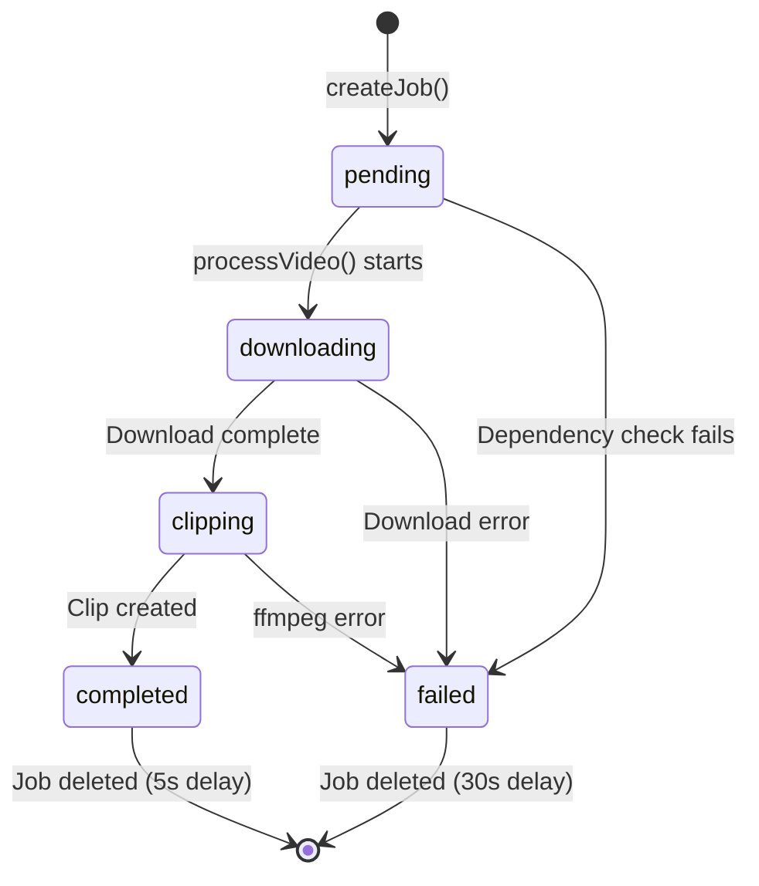

# Job State Machine

This document describes the state machine that governs video processing jobs in YT Clipper.

## States

| State         | Description                       | Progress |
| ------------- | --------------------------------- | -------- |
| `pending`     | Job created, waiting to start     | 0%       |
| `downloading` | Video being downloaded via yt-dlp | 0-50%    |
| `clipping`    | Video being clipped via ffmpeg    | 50-95%   |
| `completed`   | Processing finished successfully  | 100%     |
| `failed`      | An error occurred                 | N/A      |

## State Diagram

## State Transitions

### `pending` → `downloading`

- **Trigger**: `processVideo()` begins execution
- **Guard**: yt-dlp and ffmpeg must be installed
- **Action**: Set progress to 0%

### `pending` → `failed`

- **Trigger**: Dependency check fails
- **Error**: "yt-dlp/ffmpeg is not installed"

### `downloading` → `clipping`

- **Trigger**: Download completes successfully
- **Action**: Progress reaches 50%, `downloadedFile` is set

### `downloading` → `failed`

- **Trigger**: yt-dlp exits with non-zero code
- **Error**: "yt-dlp exited with code X"

### `clipping` → `completed`

- **Trigger**: ffmpeg creates the clip file
- **Action**: Progress set to 100%, `clippedFile` is set

### `clipping` → `failed`

- **Trigger**: ffmpeg exits with non-zero code
- **Error**: "ffmpeg exited with code X"

## Job Lifecycle

1. **Creation**: Job created with `pending` status, saved to `data/jobs/{videoId}.json`
2. **Processing**: Background async processing via `processVideo()`
3. **Cleanup**: Job file deleted after 5s (success) or 30s (failure)

## Key Files

- [types.ts](file:///Users/santoshvenkatraman/Personal/Coding/yt-clipper/src/lib/types.ts) - `JobStatus` type definition
- [jobQueue.ts](file:///Users/santoshvenkatraman/Personal/Coding/yt-clipper/src/lib/jobQueue.ts) - Job CRUD operations
- [videoProcessor.ts](file:///Users/santoshvenkatraman/Personal/Coding/yt-clipper/src/lib/videoProcessor.ts) - State transitions
